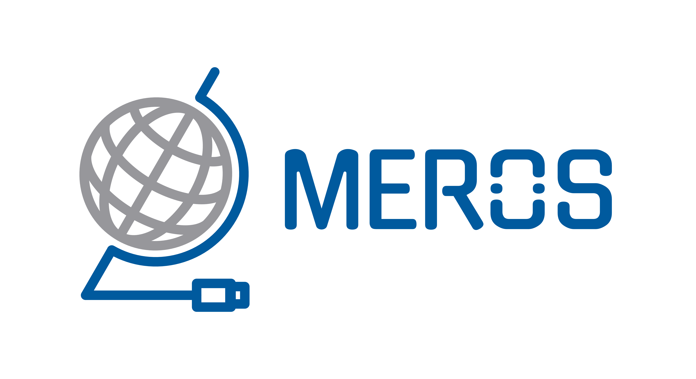

# OpenStack-Images
This Repository contains a bunch of Cloud Images designed to run in the Meros OpenStack Cloud enviroment.



## Supportet Operating Systems
### Ubuntu
+ 18.04 LTS
+ 20.04 LTS
+ 22.04 LTS

### Debian
+ 10
+ 11

### AlmaLinux
+ 8.5

### FreeBSD
+ 13

### Windows (next up)
+ W2k22

## Image Preperation
The Default login for all Linux and FreeBSD based Images are:

 `root`:`mer0s`

All Linux based Images are hardened with the following baseline.

https://github.com/dev-sec/linux-baseline

### Regenerate CloudInit Image

```bash
cloud-localds cloud-init.img cloud-init.yml
```
